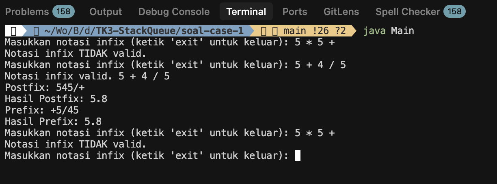
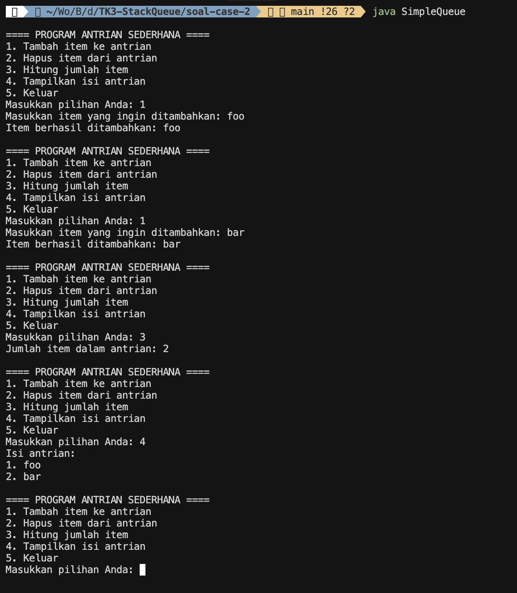

# TK3 - Stack & Queue (Week 8)


## **Pembagian Tugas Tim**

1. **Novita**: Validasi notasi infix.
2. **Ratson Febriananta Gultom**: Konversi infix → postfix.
3. **Axel Fabianto**: Konversi infix → prefix.
4. **Axel Fabianto & Ratson Febriananta Gultom**: Evaluasi postfix & prefix.
5. **Nanda Reynaldi**: Implementasi queue & perhitungan item.

## **Deskripsi Tugas**

Tugas ini terdiri dari 2 case:

### Case 1


Tugas ini membahas implementasi **Stack** dan **Queue** dengan fokus pada:

- Konversi notasi infix menjadi postfix & prefix.
- Evaluasi ekspresi postfix & prefix.
- Implementasi queue untuk menghitung jumlah item dalam antrian.

### Case 2

Tugas ini membahas implementasi *Queue*
- Penjelasan queue sebagai struktur data linear dengan prinsip FIFO (First In First Out) dapat dijelaskan melalui fungsionalitas `enqueue` dan `dequeue`.
- Time Complexity:
  - `enqueue()` dan `dequeue()` → __O(1)__ karena langsung menambahkan atau menghapus dari posisi tertentu tanpa perulangan.
  - `displayQueue()` → __O(n)__ di mana n adalah jumlah item dalam queue.


## **Cara Menjalankan**

1. Cara menjalankan paling simple dengan command:
   ```bash
   make run-case-1
   ```
   atau
   ```bash
   make run-case-2
   ```
   lihat daftar command
   ```bash
   make help
   ```

2. Atau compile program secara manual:
   ```bash
   cd soal-case-1
   javac Main
   java Main
   ```
